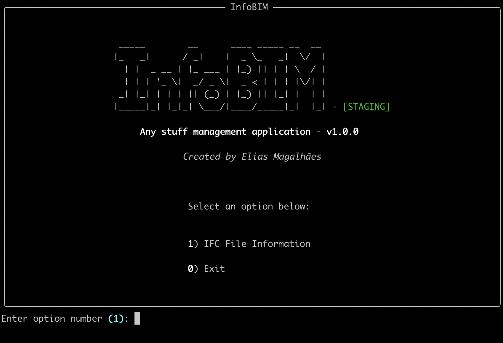

<div>
  <div style="display: inline-block; vertical-align: middle;" width="100">
    
  </div>
  <div style="display: inline-block; vertical-align: middle; margin-left: 10px;">
    <h1 style="margin: 0; border-bottom: none;">InfoBIM — The Technical Response Factory for AECO</h1>
  </div>
</div>


> **"BIM on the inside, drawings on the outside, data for everyone."**

**InfoBIM** is an operational hub for **triage, audit, and execution** of BIM data (focusing on IFC + BCF). It is designed to be operated by humans via **TUI** (terminal) and by **AI Agents** via natural language - ensuring **deterministic execution** through auditable scripts.

It exists to solve a classic AECO problem: the dependency on heavy proprietary software to answer simple technical questions under pressure (e.g., *"how many m² is the roof?"*, *"what is the material list?"*, *"reply to BCF #17"*).

---

## 🏗️ The Hybrid Concept: TUI + Infra + AI

The project consolidates scattered tools into a coherent architecture that unites three worlds:

### 1. The Human Interface (TUI)
Built on **Textual** and **Rich**, offering a modern terminal experience. Fast, lightweight, and focused on productivity.
*   **Triage & Navigation**: Automatic directory scanning and IFC filtering.
*   **Inspection**: Dynamic technical reports rendered via Jinja2.
*   **Visual Feedback**: The system rejects raw text. It uses `print_message_box`, semantic colors, and real-time progress indicators.

### 2. Infrastructure as Product
The **InfoBIM Infrastructure Stack** (this repository) is the meta-framework that ensures the software runs anywhere.
*   **Radical Standardization**: Docker and a rigid folder structure (`stack/`, `data/`) eliminate "it works on my machine".
*   **Check & Repair**: The system self-diagnoses (`./infobim check`). If something breaks, it attempts to fix it or instructs the human with surgical precision.
*   **Prompt as Code (PEaC)**: Instructions for AIs are versioned (`stack/prompts/`), ensuring automated agents follow the same business rules as humans.

### 3. The Artificial Brain (LLM as Planner)
Here lies the strategic innovation:
*   **LLM Plans, It Doesn't Execute**: An AI doesn't "guess" the roof area by reading the IFC file text. It understands the user's question and decides which **deterministic script** to call.
*   **Deterministic Execution**: The actual calculation is performed by auditable Python/OntoBDC code, ensuring engineering precision.
*   **Multilingual**: The user asks in Portuguese, English, or Spanish; the system translates the intent into standardized technical commands.

---

## 🎥 Preview

<table>
<tr>
<td width="50%">
<a href="">

</a>
</td>
<td width="50%">
<a href="">

</a>
</td>
</tr>
<tr>
<td align="center"><b>Main Menu</b><br/>The central hub for triage and navigation.</td>
<td align="center"><b>IFC File Details</b><br/>Structured inspection and reporting.</td>
</tr>
</table>

---

## 🧩 Architecture & Data Flow

### Layers
1.  **Presentation (TUI)**: Manages input/output and screens.
2.  **Adapters**: The bridge between CLI/TUI and the Core (e.g., `ImporterAdapter`).
3.  **Domain (OntoBDC)**: The BIM business rules engine and persistence layer.
4.  **Infrastructure**: Bash scripts (`stack/*.sh`) and Docker orchestrating the environment.

### Event Sourcing (Project Mode)
Unlike systems that rely on file comparisons (IFC diffs), InfoBIM focuses on **action traceability**.
*   Every operation (import, fix, export, BCF reply) is a registered event.
*   The project history is the sum of these events, allowing for objective auditing: *"Who did what, when, and with which parameters?"*

---

## 🚀 Project Status

*   ✅ **Concept & Architecture**: Defined (TUI + Stack + LLM Planner + Event Sourcing).
*   🧱 **In Progress**: Consolidating infrastructure scripts into the `./infobim` command.
*   🧪 **In Progress**: Local agent reading versioned prompts from `stack/prompts/`.
*   🛠️ **Planned**: API Gateway for Client-Server (Provider) mode.

---

## 📚 Documentation

Detailed documentation is available in the `docs/` directory:

- **[Getting Started](docs/getting_started.md)**: Setup guide and first steps.
- **[Architecture](docs/architecture.md)**: System design and core concepts.
- **[CLI Reference](docs/cli_reference.md)**: Guide to commands and flags.
- **[Development Guide](docs/development.md)**: Contributing and coding standards.

---

## ⚙️ How to Run

The tool is designed to run in containers, ensuring the execution environment is identical for all stakeholders.

### Prerequisites
- Docker Engine
- Docker Compose

### Commands

1.  **Install & Check**
    ```bash
    ./infobim install
    ./infobim check
    ```

2.  **Start CLI (Interactive Mode)**
    ```bash
    ./infobim ifc
    ```

---

## 🤝 Distribution Model

InfoBIM is Open Source at its core but commercially viable via the **Provider** model.

*   **Local (Open Source)**: For technical users. Requires Docker and terminal knowledge. Free and unlimited.
*   **Provider (API)**: For the general AECO market. Users access the TUI (or future Web) connected to a managed API, eliminating infrastructure friction.

---

## 📄 License

This project is licensed under the **Apache License 2.0**. See the [LICENSE](LICENSE) file for details.

<div align="center">
  <b>Proudly developed in Brazil 🇧🇷, so far</b>
</div>
