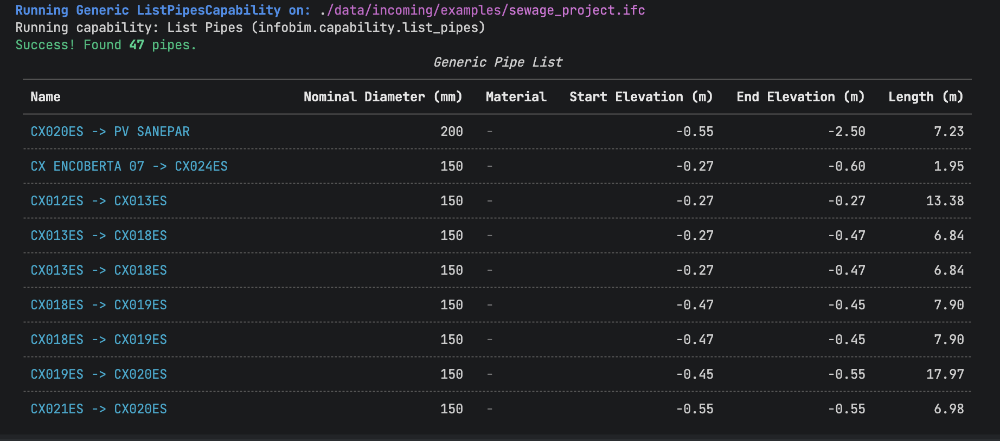
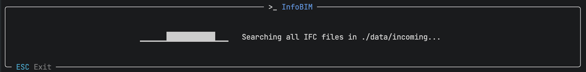
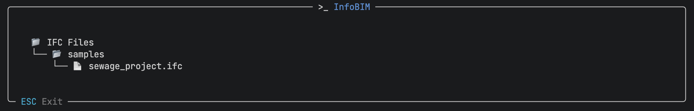

# InfoBIM IFC

<div align="center">
<pre>
  _____        __      ____ _____ __  __
 |_   _|      / _|    |  _ \_   _|  \/  |
   | |  _ __ | |_ ___ | |_) || | | \  / |
   | | | '_ \|  _/ _ \|  _ < | | | |\/| |
  _| |_| | | | || (_) | |_) || |_| |  | |
 |_____|_| |_|_| \___/|____/_____|_|  |_|
</pre>
</div>


### The Capability Engine for BIM Automation

> **Turn your BIM scripts into standardized, agent-ready capabilities.**

**InfoBIM IFC** is a modular runtime environment for Engineering Automation. It decouples the **execution logic** (how to run scripts, handle dependencies, manage Docker) from the **business logic** (validating pipes, counting doors, auditing models).

Whether you are a human running commands in the terminal or an **AI Agent** planning a complex workflow, InfoBIM provides the standard interface to interact with BIM data.

---

## 🚀 Quick Start

### 1. Install
```bash
# 1. Install via pip
pip install infobim

# 2. Verify installation
infobim --help

# 3. (Optional) Run a command
infobim run --ifc-path ./data/model.ifc --global-id 1VB9G8xuL3MArqCPoqhS3L
```

### 2. Run a Capability
Execute a specific task directly without opening the full UI:

```bash
# List all sewage pipes (validating against NBR 8160)
infobim run --id org.infobim.domain.ifc.capability.inspect_element --ifc-path ./data/model.ifc --global-id 1VB9G8xuL3MArqCPoqhS3L
```



### 3. Agent Discovery (New!)
Are you an LLM or building an Agent? Get the full machine-readable catalog of available tools:

```bash
infobim run --json
```

### 4. File Discovery & Scanning
Automatically scan and index IFC files located in the `data/incoming` directory. This is the first step to bring your BIM models into the InfoBIM environment.

```bash
./infobim ifc scan
```

The system will search for `.ifc` files and display them in the terminal:



Once scanned, the files are ready to be processed by other capabilities:



### 5. System Health & Maintenance
InfoBIM includes self-diagnostic tools to ensure your environment is correctly configured.

**Run System Check:**
Verifies if all dependencies (Python, Git, Venv, Docker) and project structures are in place.
```bash
infobim check
```

**Auto-Repair:**
If a check fails, you can try the repair mode, which attempts to fix common issues automatically (e.g., recreating venv, installing missing requirements).
```bash
infobim check --repair
```

---

## 🧩 Capabilities

A **Capability** is the atomic unit of work in InfoBIM. It wraps your Python scripts with:
1.  **Metadata**: Name, version, description.
2.  **Schema**: Formal definition of Inputs (arguments) and Outputs (return data).
3.  **Docs**: Embedded documentation for both humans and LLMs.

### Included Capabilities

| ID | Description |
|----|-------------|
| `org.infobim.domain.ifc.capability.list_elements` | Lists IFC elements with basic properties (GlobalId, Name, Type). |
| `org.infobim.domain.ifc.capability.list_property_sets` | Lists all Property Sets and properties for a specific element. |
| `org.infobim.domain.ifc.capability.list_buildings` | Lists Buildings and their Storeys with elevations. |
| `org.infobim.domain.ifc.capability.inspect_element` | Detailed inspection of an element, including attributes, hierarchy and property sets. |

---

## 🏗️ Architecture

InfoBIM is a modular CLI framework for BIM data processing.

*   **Core**: Provides the execution runtime and capability management.
*   **Modules**: Extend functionality (e.g., IFC processing, validation).
*   **Interfaces**:
    *   **CLI**: Direct execution (`infobim run ...`).
    *   **JSON Output**: Machine-readable output for integration with other tools/agents.

---

## 🤖 For AI Agents

InfoBIM is **Agent-First**.
*   **Discovery**: `run --json` provides the tool definitions (compatible with OpenAI/Claude function calling).
*   **Deterministic Execution**: Agents don't "guess" geometry; they call Capabilities that return precise data.
*   **Structured Output**: All capabilities return strict JSON data, making it easy for LLMs to reason about the results.

---

## 📄 License

This project is part of the **InfoBIM Community**.
Licensed under **Apache 2.0**.

<div align="center">
  <b>Proudly developed in Brazil 🇧🇷, so far</b>
</div>
