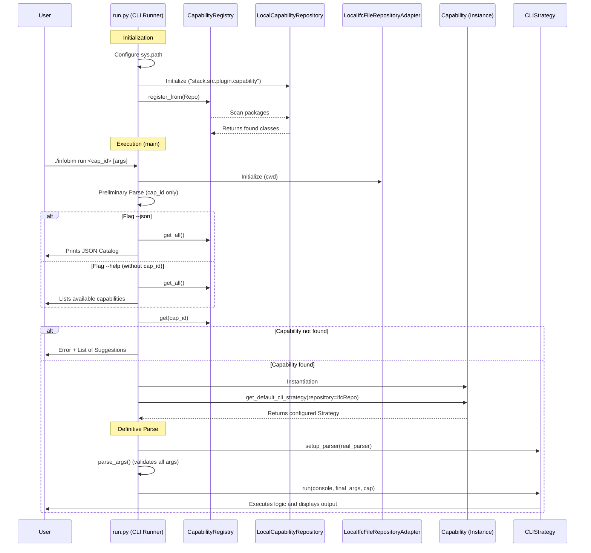

# Technical Specification: InfoBIM CLI Runner (`run.py`)

## 1. Overview
The `stack/run.py` script acts as the **Entry Point** and **Dispatcher** for the InfoBIM CLI system. Its primary responsibility is to initialize the environment, discover available capabilities, interpret user intent (via command-line arguments), and delegate execution to the requested capability's specific strategy.

## 2. Sequence Diagram

## 3. Step-by-Step Execution Flow

### Phase 1: Bootstrap and Discovery
1.  **Path Configuration:** The script adds the project root to `sys.path` to ensure absolute imports (`stack.*`) work correctly.
2.  **Auto-Discovery:**
    *   Instantiates a `LocalCapabilityRepository` pointing to the plugin package (`stack.src.plugin.capability`).
    *   The `CapabilityRegistry` scans this repository and registers all classes that inherit from `Capability` and possess valid metadata.

### Phase 2: Intent Interpretation
3.  **Preliminary Parsing:**
    *   The script uses `argparse` in partial mode (`parse_known_args`) to read only the first argument: the `capability_id`.
    *   This is necessary because we do not yet know which specific arguments the capability requires.
4.  **Global Metadata Handling:**
    *   If the `--json` flag is present, the runner aborts normal execution and prints a JSON catalog of all capabilities (used by external agents/tools).
    *   If the `--help` flag is called without an ID, it displays a list of available capabilities.

### Phase 3: Instantiation and Configuration
5.  **Capability Resolution:** Looks up the class corresponding to the ID in the registry. If not found, displays an error and lists valid options.
6.  **Dependency Injection:**
    *   Instantiates a `LocalIfcFileRepositoryAdapter` linked to the current directory (`os.getcwd()`).
    *   Requests the CLI strategy from the capability (`get_default_cli_strategy`), injecting the file repository. This allows the capability to access files without relying on hardcoded paths.

### Phase 4: Delegated Execution
7.  **Definitive Parsing:**
    *   Creates a new `ArgumentParser`.
    *   Calls the strategy's `setup_parser` method, allowing the capability to define its own arguments (e.g., `--ifc-path`, `--lang`, `--filter`).
    *   Executes the full parse.
8.  **Handover:**
    *   Calls the strategy's `run` method, passing the console (Rich), processed arguments, and the capability instance.
    *   From this point on, `run.py` steps aside and the capability-specific logic takes over.

## 4. Conditions and Prerequisites

For `run.py` to function correctly, the following conditions must be met:

1.  **Directory Structure:**
    *   The script must be located at `stack/run.py`.
    *   The project root must contain accessible `stack.src...` packages.
2.  **Capability Definition:**
    *   Capabilities must be in the `stack.src.plugin.capability` package.
    *   They must inherit from `Capability` and define `METADATA`.
    *   They must implement `get_default_cli_strategy`.
3.  **Python Environment:**
    *   Dependencies installed: `rich`, `argparse`, `sys`, `os`.
    *   Python 3 interpreter configured.
4.  **Permissions:**
    *   Read permission in the current directory (for `LocalIfcFileRepositoryAdapter`).
