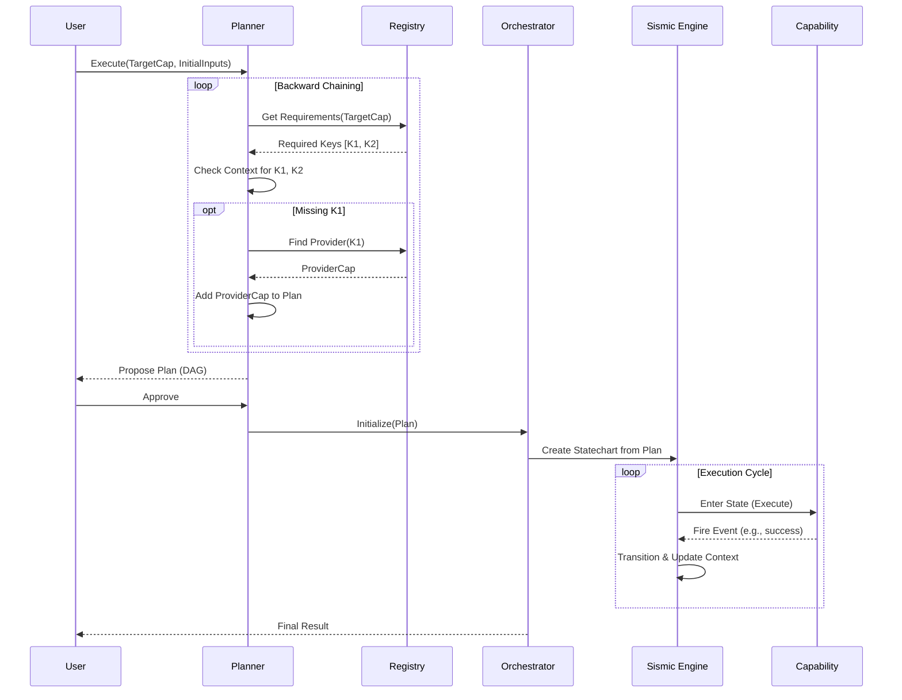

# Technical Specification: Execution Planner and Orchestration (`SPEC-002`)

## 1. Overview
This specification details the architecture for the **Execution Planner**, a component responsible for transforming a high-level user intent into a deterministic execution plan. The system leverages **Backward Chaining** on ontological metadata to resolve dependencies and utilizes the **Sismic** library (Statecharts) to orchestrate the execution flow.

## 2. Architecture Components

### 2.1. Capability Registry (Knowledge Base)
Acts as the source of truth, indexing all capabilities by:
*   **ID:** Unique identifier.
*   **Input Schema:** Required ontological keys (`org.ontobdc.*`).
*   **Output Schema:** Produced ontological keys (`org.ontobdc.*`).
*   **Events:** Possible execution outcomes.

### 2.2. Planner (Dependency Resolver)
Uses a **Backward Chaining** algorithm to construct a DAG (Directed Acyclic Graph) of capabilities.

*   **Goal:** A set of ontological keys requested by the user or implied by the target capability.
*   **Process:**
    1.  Start with the Target Capability.
    2.  Identify missing required inputs (keys not present in Global Context).
    3.  Search Registry for capabilities that produce these keys in their `output_schema`.
    4.  Add providing capabilities to the graph as dependencies.
    5.  Repeat recursively until all inputs are resolved or found in the initial Context (User Input).

### 2.3. Orchestrator (Statechart Engine)
Uses **Sismic** to execute the plan. Each capability execution is modeled as a State or a nested Statechart.

*   **State:** Represents the execution of a Capability.
*   **Transitions:** Triggered by Capability Events (`success`, `failure`, `empty`).
*   **Context:** Shared memory (Blackboard) storing values for ontological keys.

## 3. Detailed Workflow

## 4. Implementation Details

### 4.1. Sismic Integration
We will map the Execution Plan to a SCXML-like structure supported by Sismic.

*   **Compound States:** Use orthogonal states if capabilities can run in parallel (future).
*   **Guards:** Use ontological values to guard transitions (e.g., `if count > 0`).
*   **Actions:** The `on_entry` action of a state invokes the `Capability.execute()`.

### 4.2. Ontological Matching
*   **Exact Match:** Input Key `org.ontobdc.A` matches Output Key `org.ontobdc.A`.
*   **Subsumption (Future):** Input `org.ontobdc.A` might be satisfied by `org.ontobdc.A.B` (specialization), but for v1 we stick to exact string matching.

## 5. Example Scenario
**User Request:** "List pipes and their materials."
**Target:** `list_pipes`

1.  **Planner** inspects `list_pipes`.
    *   Requires: `ifc_path` (Provided by user).
    *   Requires: `material_list` (Missing).
2.  **Planner** searches for `material_list` provider.
    *   Finds: `resolve_materials` capability.
3.  **Plan:**
    *   Step 1: `resolve_materials` (Input: `ifc_path`) -> Output: `material_data`.
    *   Step 2: `list_pipes` (Input: `ifc_path`, `material_data`) -> Output: `pipe_list`.

## 6. Open Questions
*   **Ambiguity:** What if multiple capabilities provide the same key? (Strategy: Prompt user or use heuristic/priority).
*   **Cycles:** How to detect and prevent circular dependencies? (DAG validation).
